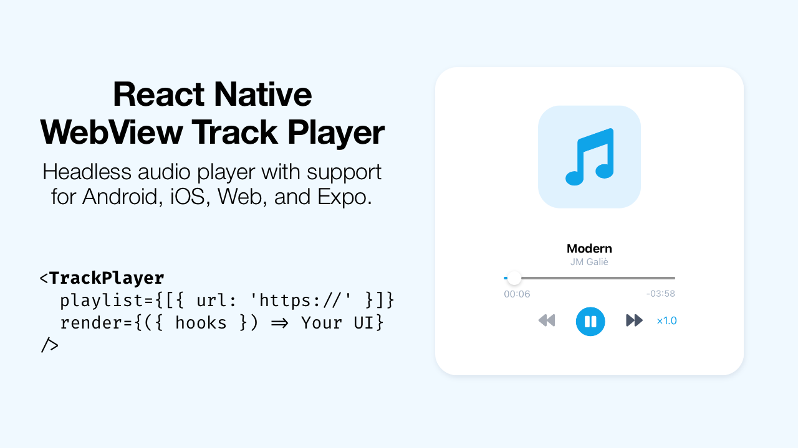

# React Native WebView Track Player

<div align="center">
  
</div>

React Native WebView Track Player is a headless audio player for building universal audio apps in React Native. It supports Android, iOS, Web, and Expo Go out-of-the-box. Using a WebView bridge, it aims to achieve similar functionality to [react-native-track-player](https://github.com/doublesymmetry/react-native-track-player) without requiring custom native code _(see comparison table below)_.

Check out the [example app](/example) for a full-fledged music player sample.

## Contents

- [Comparison](#comparison)
- [Highlights](#highlights)
- [Installation](#installation)
- [Usage](#usage)
- [Types](#types)
- [Contributing](#contributing)
- [License](#license)

## Comparison

|                            | react-native-track-player | expo-av                       | react-native-webview-track-player                                                                                                                   |
| -------------------------- | ------------------------- | ----------------------------- | --------------------------------------------------------------------------------------------------------------------------------------------------- |
| Expo/Expo Go compatibility | ❌                        | ✅                            | ✅                                                                                                                                                  |
| Web compatibility          | ❌                        | ✅                            | ✅                                                                                                                                                  |
| Background audio play      | ✅                        | ❌ (not without a build flag) | ✅                                                                                                                                                  |
| Lock-screen controls       | ✅                        | ❌                            | ✅\* (iOS & Web, no Android due to [lack of MediaSession API](https://developer.mozilla.org/en-US/docs/Web/API/MediaSession#browser_compatibility)) |
| Built-in activity          | ❌                        | ❌                            | ✅                                                                                                                                                  |
| True native bridge         | ✅                        | ✅                            | ❌                                                                                                                                                  |

From my experience, adopting a WebView bridge made audio playback a far more stable and consistent experience on iOS and especially Android. Plus, we gain seamless Web compatibility instead of the bundle splitting/conditional imports required when using `react-native-track-player` with React Native Web. That being said, a WebView bridge brings its own shortcomings (CORS with non-public URLs, HTML5 `<audio>` filetypes, etc.), so weigh in your own project needs carefully.

## Highlights

- Minimal core library, 1 file, ~600 SLOC.
- 1 peer dependency, `react-native-webview`.
- Expo Go, iOS Simulator, Web all work out-of-the-box with background audio and screen locking.
- Render prop pattern over manually-exposed hooks (core manages all of the state/hooks for you, so you only need to provide the UI).
- Track activity, plays, pauses, percentages listened, etc. are all automatically managed. A simple `onActivity` callback helps build analytics easily. By default, nothing is stored or transmitted.

## Installation

Using your desired package manager (npm install, yarn add, bun add, etc.), add `react-native-webview-track-player` and its one required peer dependency `react-native-webview` to your project. Eg. with npm:

```sh
npm install react-native-webview-track-player react-native-webview --save
```

If you added `react-native-webview` for the first time, refer to its [getting started guide](https://github.com/react-native-webview/react-native-webview/blob/master/docs/Getting-Started.md) if needed.

No assumptions are made on React/React Native versions or Expo SDKs. The latest of both should work without issue. As of current, the sample app is running on Expo SDK `49`, React `18.2.0`, React Native `0.72.6`, and React Native WebView `13.6.3`.

## Usage

Here is a minimal working example:

```tsx
import React from "react";
import { SafeAreaView, Text, Pressable } from "react-native";
import TrackPlayer, {
  type TrackPlayerRenderProps
} from "react-native-webview-track-player";

const playlist = [
  {
    id: "e8DPlI",
    title: "Modern",
    artist: "JM Galiè",
    audio: {
      url: "https://raw.githubusercontent.com/harismh/react-native-webview-track-player/main/.github/audio/sample.mp3"
    }
  }
];

const renderPlayer = ({ playerState, playPause }: TrackPlayerRenderProps) => (
  <SafeAreaView>
    <Pressable onPress={playPause}>
      <Text>{playerState.playing ? "Pause" : "Play"}</Text>
    </Pressable>

    <Text>Player State: {JSON.stringify(playerState)}</Text>
  </SafeAreaView>
);

const MinimalPlayer = () => (
  <TrackPlayer playlist={playlist} render={renderPlayer} />
);

export default MinimalPlayer;
```

There are many more props you can destructure or pass in to customize it further. See the [example app](/example) in the repo for a fuller example.

## Types

All type definitions are located in `index.d.ts`. The major types are:

| Type                                     | Defn.                                                                                                                                                          | Optional? | Notes                                                                                                                                                                                                                                                                                                                                                                                                                                                                                                                                                                                                                                                                                                                                                                                                                                            |     |
| ---------------------------------------- | -------------------------------------------------------------------------------------------------------------------------------------------------------------- | --------- | ------------------------------------------------------------------------------------------------------------------------------------------------------------------------------------------------------------------------------------------------------------------------------------------------------------------------------------------------------------------------------------------------------------------------------------------------------------------------------------------------------------------------------------------------------------------------------------------------------------------------------------------------------------------------------------------------------------------------------------------------------------------------------------------------------------------------------------------------ | --- |
| `TrackPlayerProps.playlist`              | Array of `PlaylistTrack`                                                                                                                                       | no        | A minimal `PlaylistTrack` is `{id: string, title: string, audio: { url: string }}`.                                                                                                                                                                                                                                                                                                                                                                                                                                                                                                                                                                                                                                                                                                                                                              |     |
| `TrackPlayerProps.render`                | Main render function                                                                                                                                           | no        | Callback receives `TrackPlayerRenderProps`.                                                                                                                                                                                                                                                                                                                                                                                                                                                                                                                                                                                                                                                                                                                                                                                                      |     |
| `TrackPlayerProps.activity`              | Map of track ids to `PlaylistActivity`                                                                                                                         | yes       | Used to bootstrap and restore activity. Typically is used in conjunction with a back-end to serialize/restore user player state.                                                                                                                                                                                                                                                                                                                                                                                                                                                                                                                                                                                                                                                                                                                 |     |
| `TrackPlayerProps.onActivity`            | Callback for any activity in the player                                                                                                                        | yes       | Can be used to build analytics/reporting. Passed-in arg to callback is `Activity`.                                                                                                                                                                                                                                                                                                                                                                                                                                                                                                                                                                                                                                                                                                                                                               |     |
| `TrackPlayerProps.config`                | `TrackPlayerConfig`                                                                                                                                            | yes       | Any config keys not passed-in will fallback to defaults.                                                                                                                                                                                                                                                                                                                                                                                                                                                                                                                                                                                                                                                                                                                                                                                         |     |
| `TrackPlayerConfig`                      | `{audioElementId: string, playerIndexKey: string, webViewPostMessageIntervalMs: number, activityIntervalMs: number, finishedTrackPercentageThreshold: number}` | yes       | Defaults: `{ audioElementId: 'rnwv_audio', playerIndexKey: 'rnwv_player_index', webViewPostMessageIntervalMs: 1000, activityIntervalMs: 20000, finishedTrackPercentageThreshold: 90 }`. `audioElementId` or `playerIndexKey` should be changed only if there are any conflicts with the defaults. `webViewPostMessageIntervalMs` is the setInterval time between RN and the WebView. Times <=1 second work best for rendering. `activityIntervalMs` sets up how often `onActivity` gets called _(`activityState` from render props gets updated continuously. `onActivity` is meant to be used as auto-debounced async/reporting calls. If you need no delay, reference `activityState` directly.)_`finishedTrackPercentageThreshold` is a number between 1-99 and is used to decide whether to send the finishedTrack activity to `onActivity`. |     |
| `TrackPlayerRenderProps.PlayerState`     | `{ playing: ?boolean, currentTime: ?number, duration: ?number, trackIndex: number, playbackRate: 1 \| 1.5 \| 2 \| 0.5 }`                                       | --        | `<TrackPlayer/>` loads each audio in the playlist lazily to reduce bandwidth. Prior to loading audio, `playing`, `currentTime`, `duration` are all null. So, your UI will need to guard against them.                                                                                                                                                                                                                                                                                                                                                                                                                                                                                                                                                                                                                                            |     |
| `TrackPlayerRenderProps.ActivityState`   | `?{ [trackId: string]: ?{ lastPositionSecs: number, totalListenedSecs: number, percentageListened: number, secToListened?: { [sec: number]: true/false }}}`    | --        | If a track is never played, activity map will be undefined until first played. `secToListened` is largely a bookkeeping prop used to create scrub-proof percentages. `onActivity` always receives `secToListened` as undefined to reduce prop size.                                                                                                                                                                                                                                                                                                                                                                                                                                                                                                                                                                                              |     |
| `TrackPlayerRenderProps.playPause`       | () => void;                                                                                                                                                    | --        | Sets current track to pause/play. Calls `onActivity` if set.                                                                                                                                                                                                                                                                                                                                                                                                                                                                                                                                                                                                                                                                                                                                                                                     |     |
| `TrackPlayerRenderProps.next`            | () => void;                                                                                                                                                    | --        | Skips to next track. Guards against index out of bounds automatically.                                                                                                                                                                                                                                                                                                                                                                                                                                                                                                                                                                                                                                                                                                                                                                           |     |
| `TrackPlayerRenderProps.previous`        | () => void;                                                                                                                                                    | --        | Skips to previous track. Guards against index out of bounds automatically.                                                                                                                                                                                                                                                                                                                                                                                                                                                                                                                                                                                                                                                                                                                                                                       |     |
| `TrackPlayerRenderProps.seekTrack`       | (trackIndex: number) => void;                                                                                                                                  | --        | Skips to the index provided. Does not guard currently.                                                                                                                                                                                                                                                                                                                                                                                                                                                                                                                                                                                                                                                                                                                                                                                           |     |
| `TrackPlayerRenderProps.scrubTo`         | (seconds: number) => void;                                                                                                                                     | --        | Skips to time provided in current track. Does not guard currently.                                                                                                                                                                                                                                                                                                                                                                                                                                                                                                                                                                                                                                                                                                                                                                               |     |
| `TrackPlayerRenderProps.setPlaybackRate` | (playbackSpeed: 1 \| 0.5 \| 1.5 \| 2 ) => void;                                                                                                                | --        | Sets the provided playback speed to the current track.                                                                                                                                                                                                                                                                                                                                                                                                                                                                                                                                                                                                                                                                                                                                                                                           |     |

## Contributing

I consider the library as feature-complete and stable as it fulfills my own needs. Pull requests and forks are welcome, though. Refer to [CONTRIBUTING.md](/CONTRIBUTING.md) for development commands.

## License

[Copyright (c) harismh MIT](/LICENSE).

Initial template bootstrapped with [create-react-native-library](https://github.com/callstack/react-native-builder-bob).
